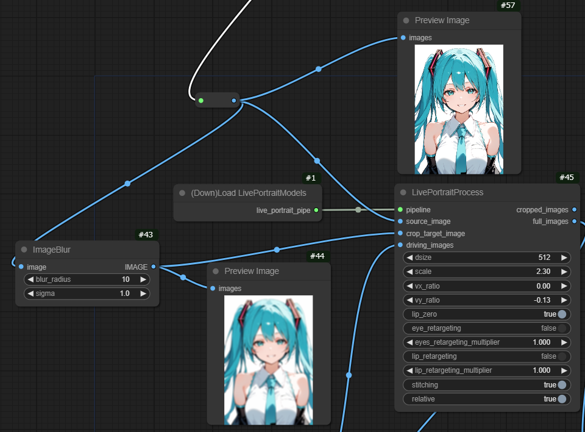

アニメイラストでは顔を検出できず以下のエラーが出ることが多いが、ぼかすことで顔を検出できることがある。  
`No face detected in the source image!`  
そのため、顔を検出する用の画像を入力する `crop_target_image` を追加した。  
  

https://github.com/nkchocoai/ComfyUI-LivePortraitKJ/assets/156806390/4fe3c26d-fd17-48c9-80a8-52e08fc5c4d1

# ComfyUI nodes to use [LivePortrait](https://github.com/KwaiVGI/LivePortrait)

https://github.com/kijai/ComfyUI-LivePortrait/assets/40791699/e55e10f6-af61-4d73-b162-af29eb847516

I have converted all the pickle files to safetensors: https://huggingface.co/Kijai/LivePortrait_safetensors/tree/main

They go here (and are automatically downloaded if the folder is not present) `ComfyUI/models/liveportrait`

Insightface is also required.
If you have a working compile encironment, installing it can be as easy as:

`pip install insightface`

or for the portable version, in the ComfyUI_windows_portable -folder:

`python_embeded/python.exe -m pip install insightface`

If this fails (and it's likely), you can check the Troubleshooting part of the reactor node for alternative:

https://github.com/Gourieff/comfyui-reactor-node

For insightface model, extract this to `ComfyUI/models/insightface/buffalo_l`:

https://github.com/deepinsight/insightface/releases/download/v0.7/buffalo_l.zip

*Please note that insightface license is non-commercial in nature.*
